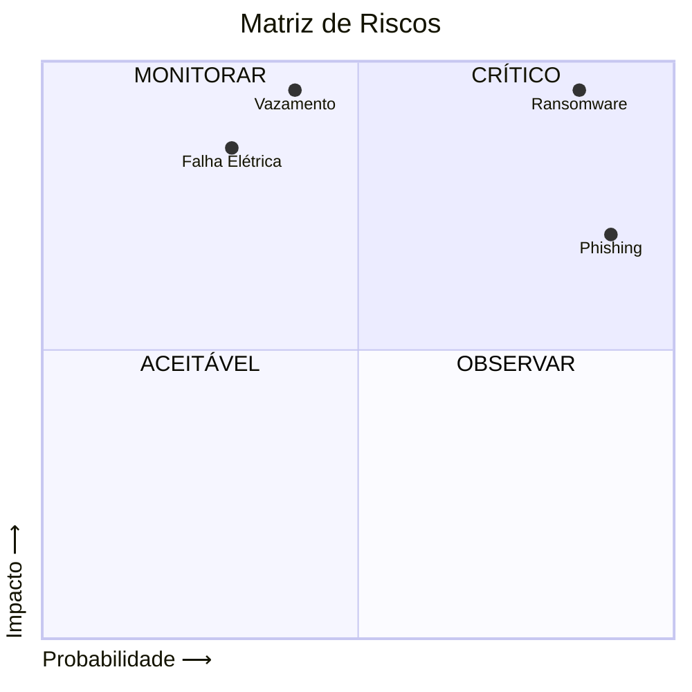

# 📌 Política de Segurança da Informação - InnovaTech

---

## 📋 Sumário
- [1. Contexto](#-1-contexto)
- [2. Governança](#-2-governança)
- [3. Análise de Riscos](#-3-análise-de-riscos)
- [4. Diretrizes de Segurança](#-4-diretrizes-de-segurança)
- [5. Regras Disciplinares](#-5-regras-disciplinares)
- [6. Aplicabilidade](#-6-aplicabilidade)

---

## 🏢 1. Contexto

**InnovaTech Solutions** — SaaS para o setor financeiro.

### Ativos Críticos
| Local | Criticidade |
|:---|:---:|
| ☁️ AWS (Produção) | 🔴 Alta |
| 🖥️ Sala de Servidores | 🔴 Alta |
| 💻 Setor Dev | 🟡 Média |
| 📁 Setor RH | 🔴 Alta |

---

## 👥 2. Governança

| Membro | Cargo |
|:---|:---|
| Ana Souza | CISO |
| Carlos Lima | Gestor(a) de TI |
| Mariana Costa | DPO |
| João Pedro | RH |

---

## 📊 3. Análise de Riscos

### Priorização
| Risco | Prioridade |
|:---:|:---:|
| 🦠 Ransomware | 🔴 **MÁXIMA** |
| 🎣 Phishing | 🟠 **ALTA** |
| 💣 Vazamento | 🟠 **ALTA** |
| ⚡ Falha de energia | 🟡 **MÉDIA** |

---
### 🔐 Controles de Acesso

---
## 🔒 4. Diretrizes de Segurança

### 🛡️ Confidencialidade
| Regra | Exigência |
|:---|:---|
| ✅ **MFA** | Obrigatório em sistemas críticos |
| ✅ **Criptografia** | Notebooks (BitLocker) + VPN |
| ✅ **Acesso mínimo** | Revisão mensal de acessos |

### 📝 Integridade
| Regra | Especificação |
|:---|:---|
| ✅ **Backup** | 3-2-1 (3 cópias, 2 mídias, 1 off-site) |
| ✅ **Teste** | Restauração mensal |
| ✅ **Hashing** | Senhas com bcrypt |

### ⏱️ Disponibilidade
| Métrica | Meta |
|:---|:---:|
| 📈 **Uptime** | 99.9% |
| ⏰ **RTO**(Fora do Ar) | 4h |
| 📊 **RPO**(Quantidade de Dados) | 1h |

**Plano de contingência:**
- ☁️ Failover AWS (us-east-1 → us-west-2)
- ⚡ Gerador com autonomia de 48h
- 🌐 ISP backup

### 👤 Fator Humano
| Regra de Ouro | Consequência |
|:---|:---|
| 🚫 **Compartilhar senhas** | 🔴 Grave |
| 🔒 **Bloquear a tela** | 🟢 Leve/Média |
| 📱 **Sem USB pessoal** | 🟡 Média |
| 🎣 **Reportar phishing** | 📢 Obrigatório |

**Treinamentos:**
- 📚 Onboarding obrigatório
- 🎯 Simulação de phishing trimestral

---

## ⚖️ 5. Regras Disciplinares

| Nível | Infração | Consequência |
|:---:|:---|:---|
| 🟢 **Leve** | Tela desbloqueada | Advertência verbal |
| 🟡 **Média** | USB não autorizado | Advertência escrita |
| 🟠 **Grave** | Compartilhar senha | Suspensão |
| 🔴 **Gravíssima** | Vazamento intencional | **Justa causa** |

---

## ✅ 6. Aplicabilidade

- ✔️ **Quem?** Todos(as) os(as) funcionários(as), estagiários(as) e terceiros(as)
- ✔️ **Onde?** Escritórios, home office e nuvem
- ✔️ **O quê?** Todos os sistemas e dados corporativos

### 📊 Matriz de Priorização de Riscos
| Risco | Impacto | Probabilidade | Prioridade |
|:---|:---|:---|:---|
| 🦠 Ransomware | 🔴 Crítico | 📈 Alta | 🔴 **MÁXIMA** |
| 🎣 Phishing | 🟠 Alto | 📈 Alta | 🟠 **ALTA** |
| 💣 Vazamento | 🔴 Crítico | 📊 Média | 🟠 **ALTA** |
| ⚡ Falha de energia | 🟠 Alto | 📉 Baixa | 🟡 **MÉDIA** |
